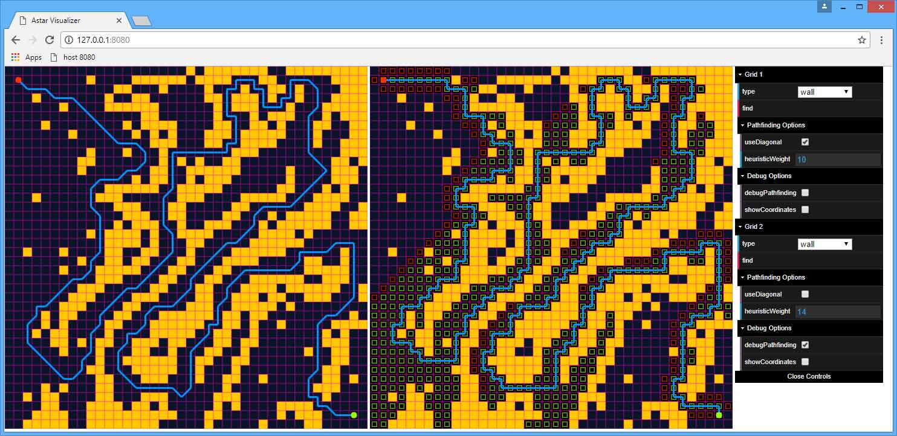

# AstarVisualization
Experiment in A* search algorithm.

## How to Run
Open index.html in a browser using a local server. 

## How to Use
Use the controls on the right side of the screen to select what block type you want to draw with, and left click drag on the grid to place those blocks. "Wall" blocks act as obstacles, while "Empty" blocks can be pathed through. Press the find button once you are ready to run the search algorithm.